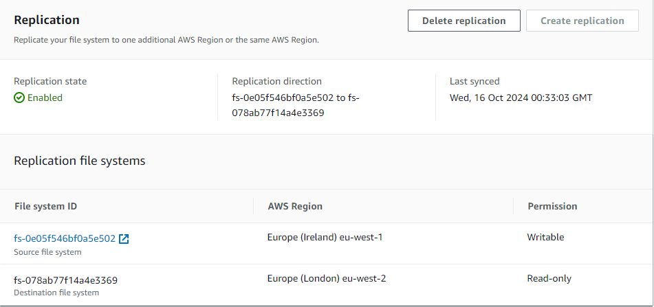

# Multi-Region Disaster Recovery avec Amazon EKS et EFS

## Introduction

Ce projet met en place une architecture de Disaster Recovery (DR) multi-régions avec Amazon Elastic Kubernetes Service (EKS) et Amazon Elastic File System (EFS). L'objectif est d'assurer la haute disponibilité des applications en répliquant les données entre deux régions AWS, afin de pouvoir basculer vers une région de secours (DR) en cas de défaillance de la région principale.

## Architecture

L'architecture repose sur plusieurs composants critiques, dont les clusters EKS pour l'orchestration des containers et EFS pour la persistance et la réplication des données entre les régions.

### Composants :
1. **Amazon EKS (Elastic Kubernetes Service)** :
   - Gère les clusters Kubernetes pour l'exécution des microservices à travers plusieurs zones de disponibilité.
   - Les nœuds EC2 dans chaque zone de disponibilité exécutent des pods Kubernetes.

2. **Amazon EFS (Elastic File System)** :
   - Système de fichiers partagé monté par les nœuds EC2 sur les clusters EKS.
   - EFS est répliqué entre la région principale et la région de récupération, assurant ainsi la synchronisation des données.

3. **Elastic Load Balancer** :
   - Répartit le trafic réseau entre les nœuds de travail EC2 dans chaque région.

4. **Réplication des données** :
   - Le système de fichiers EFS de la région primaire est répliqué en temps réel vers un autre EFS dans la région de récupération, garantissant la synchronisation des données.

### Schéma de l'architecture :

1. **Région 1 - Primary** :
   - Un cluster EKS est déployé dans deux zones de disponibilité (AZ1 et AZ2).
   - Chaque AZ dispose de nœuds de travail EC2 hébergeant des pods Kubernetes.
   - Les volumes persistants (PV) sont montés depuis EFS, et les pods accèdent aux données via des Persistent Volume Claims (PVC).
   - Le trafic est distribué via un Elastic Load Balancer.

2. **Région 2 - Disaster Recovery (DR)** :
   - En cas de défaillance dans la région principale, la région DR prend le relais.
   - Le cluster EKS dans la région DR est prêt à monter le même système de fichiers EFS répliqué.
   - Les données sont accessibles à travers les nœuds EC2 de la région DR via des PV et PVC.
   - Le basculement du trafic se fait également par un Elastic Load Balancer.

## Fonctionnalités

- **Haute disponibilité** : Les applications sont déployées sur plusieurs zones de disponibilité pour garantir leur disponibilité en cas de panne dans une AZ.
- **Disaster Recovery** : Les données critiques sont automatiquement répliquées dans une région DR, assurant la continuité des services même en cas de sinistre.
- **Kubernetes** : Gestion des applications conteneurisées avec Amazon EKS pour orchestrer les déploiements dans les deux régions.
- **Réplication des données** : EFS permet une réplication rapide des fichiers entre les deux régions pour assurer une synchronisation en temps réel.

## Pré-requis

- Compte AWS avec accès à Amazon EKS et EFS.
- Un cluster EKS déployé dans les deux régions (Primary et DR).
- Configuration de la réplication entre les systèmes de fichiers EFS dans les deux régions.
- Utilisation d'un Elastic Load Balancer pour rediriger le trafic entre les nœuds EC2.

## Déploiement

1. **Déployer le cluster EKS dans la région primaire** :
   - Utiliser les outils comme `eksctl` ou CloudFormation pour provisionner un cluster EKS.
   - Assurez-vous que les nœuds EC2 dans chaque AZ montent correctement le système de fichiers EFS.

2. **Configurer la réplication EFS** :
   - Créer un système de fichiers EFS dans la région primaire et configurer la réplication vers la région de récupération (DR).

3. **Déployer les ressources dans la région DR** :
   - Déployer un cluster EKS identique dans la région DR.
   - Vérifier que le système de fichiers EFS répliqué est monté sur les nœuds EC2 du cluster EKS dans la région DR.

4. **Basculement automatique** :
   - Configurer des outils de monitoring comme Amazon CloudWatch pour détecter les pannes dans la région primaire.
   - Implémenter un plan de reprise d'activité pour basculer automatiquement les services vers la région DR en cas de sinistre.

## Monitoring et Alarming

- **Amazon CloudWatch** : Surveillance des ressources EKS et EFS avec des alarmes pour signaler toute anomalie.
- **Elastic Load Balancer** : Monitoring du trafic réseau pour basculer entre les clusters dans chaque région en fonction de la disponibilité.

## Étapes de déploiement

### 1. Configuration des VPC

Voici une capture d'écran montrant la configuration des VPC :

### 2. Configuration du cluster EKS

Voici une capture d'écran montrant la configuration du cluster EKS :

### 3. Les Mount Target d'EFS sur les differents subnets

Cette capture d'écran montre la configuration des mount targets :

### 4. Réplication d'EFS entre les régions

Cette capture d'écran montre la configuration de la réplication entre deux systèmes de fichiers EFS :

### 5. Création de Pod pour vérifier que les storageclass fonctionne

## Conclusion

Cette architecture fournit une solution robuste pour garantir la disponibilité et la persistance des données dans des environnements critiques. En utilisant EKS et EFS, nous avons assuré une gestion efficace des conteneurs et une réplication des données entre plusieurs régions AWS pour un Disaster Recovery optimisé.
